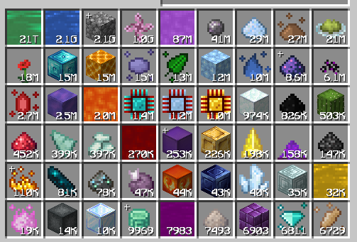
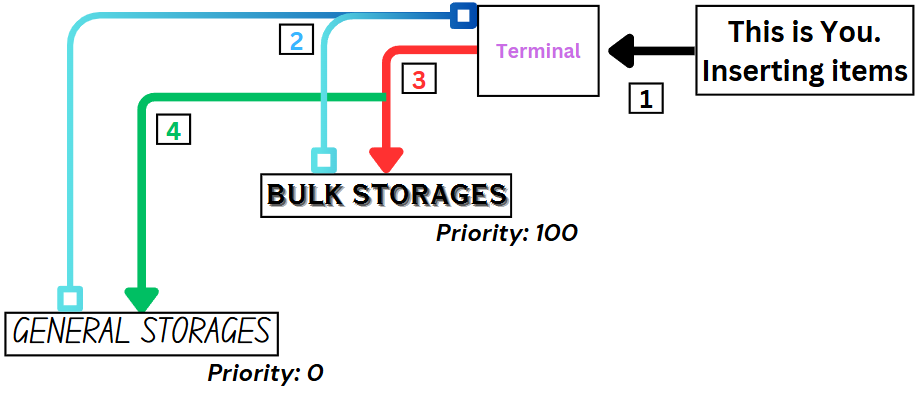

# *This is bulk skits*

The key concepts of this subchapter are **General** & **Bulk** Storage.

???+ warning "Familiarize yourself with these required items"
    

    - Cell Workbench
    - MEGA Bulk Item Storage Cell
    - MEGA Decompression Module
    - Compression Card

---

## Where the "bulk" term is used
Before we go deeper, one might ask what "bulk" is, why we use it in storage, or where we find it—moreover, the importance of it to AE2 in this topic.

Take a look at this mess:

{.center}

From the image above, there are random things like building blocks, seeds, saplings, and miscellaneous materials. We also notice that most of these items do not exceed 3,000 items. We'll call this a **Random Mess**.

In contrast, the image below shows that those items are stored in vast quantities compared to the previous one. We'll refer to this as a **Bulk Mess**.

{.center}

## General vs Bulk Storage

All of those random items are typically stored inside what we call **"General Storage"**. In a literal sense,
!!! quote "every dump of items we make into the network will eventually end up in this type of storage."

Just like the Random Mess we had before. Any other things then will be stored inside **"Bulk Storage"**  
!!! note "A literal "storing items in bulk!""

## Partition?

In case it's not apparent, 'partitioning' cells is an **important aspect** when we talk about bulk storage. Imagine your creeper farm generating thousands upon thousands of gunpowder per minute; this will clog up your general storage quickly over time (you don't want your cells filled up with gunpowder **only**, don't ya?).

In this case, we **partition** a cell (generally the ones that can store a lot) and assign an item to a specific cell. The **Priority System** in AE2 means you can tell items to go into particular drives **first they go into another storage.

???+ tip "If you're looking on how to partition"
    Head over to [How To Partition A Cell](bulkhow.md)

???+ info "The route items take in a network"
    

    The system works like this:

    1. You insert items into the network
    2. The network now tries to "store" said items in a valid 'storage' space
    3. It starts with the highest priority storage (in this case, Bulk storage, which **only accepts gunpowder**)
    4. If it fails to store said items in the Bulk Storage (say, **a stick**), it checks again the next valid storage (the stick is eventually stored inside general storage)

    > Thus, gunpowder always gets stored first inside bulk storage, and anything that isn't gunpowder is stored inside general storage. It doesn't clog the system; you can always dump more items into it. **This is why bulk storage is important**

    ??? example "Example of this concept, visualized in an actual setup"
        

        - The terminal can also represent an access point. This means it can be a point where the network can accept items (hence why a **Pattern Provider** & an **Interface** are shown alongside the **Terminal**)

---

Take a look at this table for a better grasp of the differences between General and Bulk Cells.

| **General Storage**    | **Bulk Storage**    |
|:---:|:---:|
| Typically stores random things (miscellaneous items) | Typically stores specific items |
| Ex. cobble walls, doors, fence, lantern, furnace | Ex. certus quartz, diamonds, cobblestone, MA essences |
| Don't usually partition | Partition is a requirement |
| Requires less work to craft and use | Requires more steps to craft and setup |
| Good for dumping unorganized items | Good for optimizing your network contents |
| Tends to be used less per ME Drive | Tends to be used more per ME Drive |
| Used when storing smaller amount of items (typically >5k) | Used when storing large amount of items (thousands/millions/billions even!) |

???+ tip "Did you know?"
    Due to how storages in AE2 works (**Bytes & Types**) 20 item cells can store **1,260** types (63x20) of items, but they store less total items than 20 **Bulk Cells**! This is also why we use the term General & Bulk storages.
 
> MEGA Cells | [CurseForge](https://legacy.curseforge.com/minecraft/mc-mods/mega-cells)
