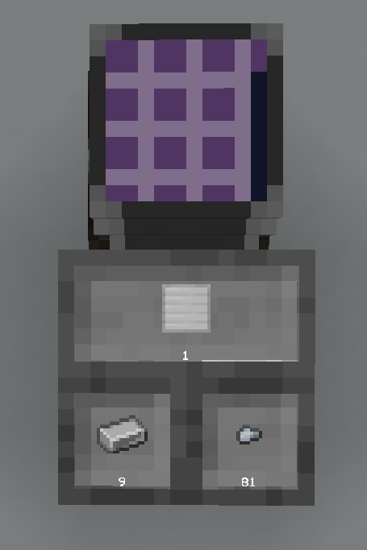
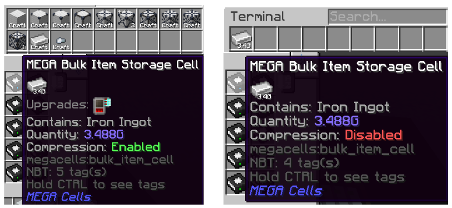

# *Everything About It*

This subchapter shows you an overview of **bulk cells** & it's accompanying tools.  

## What Are Those?

### Bulk Cells

**MEGA Bulk Item Storage Cell**, further referred as 'Bulk Cells', is a storage cell from **MEGA Cells**.

Bulk Cells is an incredibly powerful cell. A single cell can only hold 1 type of item **but** can practically store an infinite items.

??? tip "Did you know that?"
    Assuming:

    - You can theoretically produce a resource at a `maxInt` value per tick (2,147,483,647 iron ingots/tick for example)
    - And do it 24/7

    It still requires **6 years, 10 months, and 7 days** to reach max capacity of `maxLong` (a 19 digit number). And ``BigInt`` can holds **more** than 268,000,000 digits (relative to your system memory of course)! This also means you **do not** need any kind of Overflow Prevention...or does it?

!!! abstract "But hey, there's more"
    On top of storing items, Bulk Cells also have the ability to **compress & decompress** items automatically!

### Compression & Decompression
Having to make a pattern to craft `nuggets` from `iron ingots`, another pattern for crafting `iron block`, AND THEN another pattern to craft those back into iron ingots is **labor-intensive**, especially when you're playing a pack that **adds more than** just iron, gold, copper, & diamonds. Up until now, you might've been using **Storage Drawers** to do this kind of thing. The Compacting Drawer, to be exact.

!!! danger "But using drawers comes with a small problem"
    Compacting Drawers (and any other variants of physical-storage-compactor from other mods) never play nice with AE2. This is because a Storage Bus (External Storage application) **reports the drawer contents incorrectly**.
    
    ??? example "Example of a misreport in AE2"
        {.center}
        {.center height='75px'}

        Here we can see that the system reads we have 81 nuggets, 9 iron ingots, and 1 iron block. But clearly **we don't have those**, since that would just mean we have 3 iron blocks. When the drawer itself definitely shows **it only has 1**. This also sometimes referred as "**Over-Report**"

!!! note "Luckily the Bulk Cells already takes care of that for us :3"

### Compression Card

{.center width='75px' height='75px'}

A Compression Card is a **Card Upgrade** that you can install in a bulk cell using a **Cell Workbench**. This thing allows the bulk cell to **auto-compress** its items.

!!! danger "No Compression Card = No Auto Compression!"

??? example "Compression vs No Compression"
    

### Decompression Module

{.center width='75px' height='75px'}

The decompression module is a device that works with compression cards to allow the network to automatically decompress items. To install it, just place it anywhere in the network (like the **Wireless Access Point**).

!!! danger "Decompression requires a **functional CPU Multiblock**!"

## Storage Drawers vs Bulk Cells

One might wonder,
!!! quote "Huh. Bulk cells seem just like **Storage Drawers**. Both can **store a lot** & **compress items**. Why would I use these cells instead of drawers?"

Then let me present to you the ups & downs.

!!! warning "Disclaimer"
    This is not to say **one is worse** than another. Both have their own pros & cons. **DO NOT** weaponize this table to go ham on another users' preferences.

| **Storage Drawers** {.center width='32' height='32'} | **Bulk Cells** {.center width='32' height='32'} |
|:---:|:---:|
| Holds up to 2.1 Billions of items | Practically holds infinite items  |
| Very cheap | Relatively more expensive |
| Very easy to get into | Quite complex to start |
| Partitions done by using items + Config Tool | Partitions done by Cell Workbench + Cards |
| Compacting Drawers can misreport item amounts | Precise compression |
| Higher-form compression might be tricky  | Handles every-form of compression innately + built-in decompression |
| Takes up more physical spaces | Quite space-efficient |
| Storage Bus readings (External Storage)  can affect performance when scaled up | Innate AE2 support (storage cell)  means more optimized when scaled up |

???+ success "Additional Notes"
    ??? tip "Regarding Space Efficiency"
        {.center}
        This is what it looks like to store 20 items in bulk. The base ME Drives holds 10 cells and the ME Extended Drive from **ExtendedAE** holds 20 cells.
    
    ??? tip "Regarding External Storage"
        External Storage is perfectly fine to do. A slight delay will happen because the storage bus tries to read every slot in a **drawer network**. This is mentioned in the **in-game guide**.

> MEGA Cells | [CurseForge](https://legacy.curseforge.com/minecraft/mc-mods/mega-cells)
> Functional Storage | [CurseForge](https://legacy.curseforge.com/minecraft/mc-mods/functional-storage)
