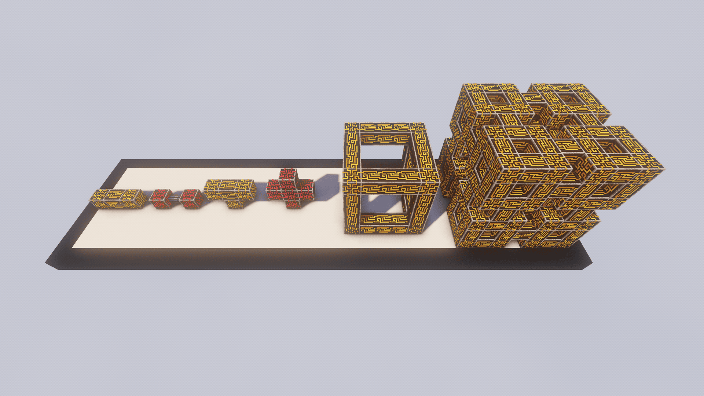

# Introduction

---

In this section, I'm going to talk all about how you get all the **resources** to get started with AE2 and the core elements function.

!!! warning "Check **EMI** / **JEI** for the recipes!"

---

## Meteor

To find a **Meteor** you can make a **Meteor Compass**.

### Inscriber Presses
Inside the meteor there is a **Mysterious Cube** which if you break it, will give you the four presses required for making **Circuits**.

### Skystone
Since you're already there, might as well mine some **Skystone** since you'll need it for some recipes later.

---

## Certus Quartz

Besides the mysterious cube, inside the meteor are also some **Budding Certus Quartz Blocks**. You can mine the **Certus Buds** growing on them for **Certus Dust** or the **Certus Cluster** for **Certus Crystals**.

Breaking the **Budding Certus Quartz** will decrease their "level" by 1. Mining them with **Silk Touch** will **not** decrease a level. (The Flawless one will lose a level regardless)

**Flawless** ➡ **Flawed** ➡ **Chipped** ➡ **Damaged** ➡ **Regular Block** 

For all but the **Flawless Budding** the level will also randomly decrease after each time **Certus Quartz** grows.

---

## Processors

To get Processors, you'll need the **Inscriber Presses** and the respective Material to turn it into a **Circuit**. Then combine that with **Redstone** and **Printed Silicon** to get a **Processor**.

---

## Fluix

You can get **Fluix Crystals** by throwing **Charged Certus Quartz**, **Redstone** and **Nether Quartz** into **Water**.

---

## Controller

The **Controller** is probably the most important block of your entire network. It will supply your network with **Power** and most important of all **Channels**.

Each Face of the **Controller** can supply your network with **32 Channels**, meaning, in theory, when using all 6 sides, you get a total of **192 Channels**.

### Rules
There are a couple of rules you have to follow when building a **Multiblock Controller**.

1. All Controllers need to **touch each other**. You cannot have multiple Controllers in one network.
2. A Controller can only touch another controller on **three faces**. You cannot surround a Controller with other Controllers.
3. The max size a controller can have is **7x7x7**. You don't have to build a square, but more the total area cannot be bigger.

For a Step-by-Step of the last one, check [Setups](setups)
